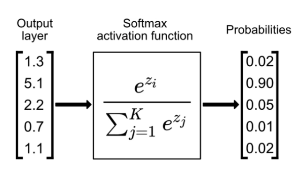

# OHE-Digit Recognition

  

My first ML project: a "single digit recognition" model using TensorFlow and Keras.   
I decided to use these frameworks because I am currently studying and using them in my   
everyday life and personal projects, such as my RoboCup competition. But how does this model work?   

<dl> 
  <dt>Model Type</dt> 
    <dd> 
      For my model, I decided to use the "Sequential API" from TensorFlow. Instead of   
      the "Functional API" or "Model Subclassing," I can easily build my model using a   
      stacked model approach. 
    </dd> 
  
  <dt>Model Build</dt> 
    <dd> 
      For the model architecture, I chose to use three Dense layers (where each neuron is   
      connected to all the neurons in the previous and next layer), with two Dropout layers   
      between them (each with a 50% rate) to prevent overfitting. The first two Dense layers have 128   
      neurons and use the Rectified Linear Unit (ReLU) activation function, while the last Dense layer has   
      10 neurons (representing the classes) to provide the probability for each output. Additionally, for the last   
      layer, I am using Softmax to "squish" a K-dimensional array (my input) into an array where the sum of all the   
      elements equals 1. 
    </dd>

  
<figure> 
  
  
 
  
 Rectified Linear Unit (ReLU) 
 
    
  
  
 
  
 Softmax 
 
</figure>
  

  <dt>Model Dataset</dt> 
    <dd> 
      For the model dataset, I used the classic MNIST dataset, which is directly loaded using Keras. In the test folder,   
      you can see my training using both the MNIST dataset as well as a custom dataset (two photos of the number "1") that I provided   
      to observe the model's performance with different data. 
    </dd> 
<dt>Final Considerations</dt> 
  <dd> Finally, for the model, I decided to use the Adam optimizer with the categorical crossentropy   
       loss function. (Adam is used to update the weights, and categorical crossentropy is used to guide the model during   
        training.) Additionally, in the `model.fit()` function, I chose to optimize for 128 epochs, a batch size of 64, and a validation   
        split of 20%. 
  </dd> 
</dl>

## Model Evaluation:

### Loss:
 

### Accuracy:
 
